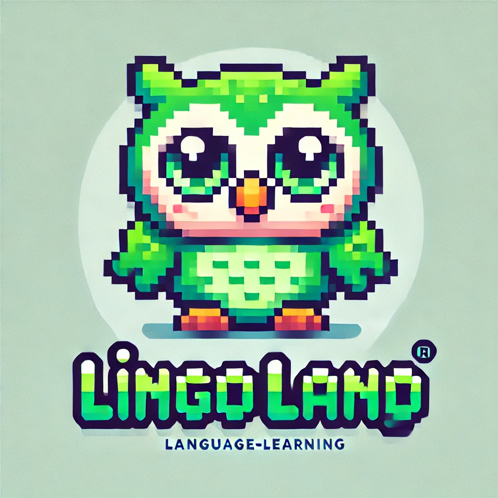
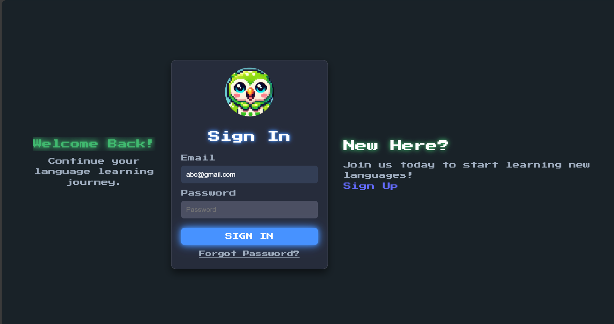

<a id="readme-top"></a>
[![Contributors][contributors-shield]][contributors-url]
[![Forks][forks-shield]][forks-url]
[![Stargazers][stars-shield]][stars-url]
[![Issues][issues-shield]][issues-url]
[![MIT License][license-shield]][license-url]

<!-- PROJECT LOGO -->
<br />
<div align="center">
  <a href="https://github.com/SathishAdithiyaaSV/lingo-land">
    
  </a>

<h3 align="center">Lingo Land</h3>

  <p align="center">
   Lingo Land is a fun, engaging platform designed to help users continue their language learning journey in a user-friendly and a gamified way. Featuring a sign-in experience reminiscent of popular platforms, it provides a welcoming and personalized experience for learners of all ages.
    <br />
    <a href="https://github.com/SathishAdithiyaaSV/lingo-land"><strong>Explore the docs »</strong></a>
    <br />
    <br />
    <!-- <a href="https://github.com/github_username/repo_name">View Demo</a> -->
  </p>
</div>


<!-- TABLE OF CONTENTS -->
<details>
  <summary>Table of Contents</summary>
  <ol>
    <li>
      <a href="#about-the-project">About The Project</a>
      <ul>
        <li><a href="#built-with">Built With</a></li>
      </ul>
    </li>
    <li>
      <a href="#getting-started">Getting Started</a>
      <ul>
        <li><a href="#prerequisites">Prerequisites</a></li>
        <li><a href="#installation">Installation</a></li>
      </ul>
    </li>
    <li><a href="#usage">Usage</a></li>
    <li><a href="#contributing">Contributing</a></li>
    <li><a href="#license">License</a></li>
  </ol>
</details>


<!-- ABOUT THE PROJECT -->
## About The Project



Youtube video link: https://www.youtube.com/watch?v=WUQ9lHb6qJk
(uploading here because the link uploaded on google form is not of good quality)

Lingo Land is a modern, scalable web application designed to provide users with an engaging and personalized language learning experience. The platform is built using a **full-stack architecture** with the latest technologies to ensure a responsive, high-performance user interface and robust backend functionality.

At its core, Lingo Land combines **React.js** for dynamic frontend development, **Node.js** and **Express.js** for building fast, scalable server-side APIs, and **MongoDB** for a flexible and scalable database solution.

### Key Features:
- **User Authentication & Management**: Secure login system with Hashed password authentication
- **Language Learning Modules**: A variety of interactive lessons that help users practice new languages, featuring gamified progress tracking, quizzes, and leaderboards.
- **Real-Time Data Synchronization**: Leveraging **MongoDB** for real-time updates on user progress and interactions.
- **Gamified UI**: Built with **CSS** to enjoy the learning of new languages similar to an environment of a game.

### Technology Stack:
- **Frontend**: 
  - **React.js**: Used for building the user interface with a page-driven architecture.
  - **CSS**: simplifies styling and custom designs, making the interface visually gamified and easy to maintain.
- **Backend**:
  - **Node.js**: A JavaScript runtime that powers the backend, enabling asynchronous, non-blocking I/O for high scalability.
  - **Express.js**: A minimalist web framework for Node.js, providing robust tools for creating RESTful APIs and handling HTTP requests efficiently.
  
- **Database**: 
  - **MongoDB**: A NoSQL database that allows for flexible, schema-less data storage, ideal for storing user profiles, progress data, and course content.

### Workflow & Interaction:
1. **Sign-In/Sign-Up**: Users can sign up and log in via secure authentication. Once logged in, their learning data is persisted across sessions.
2. **Language Modules**: After authentication, users can access language learning modules that include lessons and quizzes.
3. **Progress Tracking**: As users complete lessons, their progress is stored and updated in real time.
4. **Gamified Experience**: The system incorporates points, levels, and leaderboards to motivate users to keep learning and progressing through their lessons.

Lingo Land aims to provide an intuitive and efficient environment for learning languages, with a smooth blend of front-end interactivity and powerful back-end processing. It’s built with scalability in mind, so new features can be added as the user base grows, from additional languages and lessons to advanced features like speech recognition and multiplayer challenges.

By leveraging modern web technologies, Lingo Land sets out to provide a high-quality user experience for learners around the world, from beginners to advanced users, through a seamless and engaging platform.


<p align="right">(<a href="#readme-top">back to top</a>)</p>


### Built With
* [![React][React.js]][React-url]
<!-- Tailwind CSS Badge -->
<!-- * [![TailwindCSS][Tailwind]][tailwind-url] -->

<!-- Node.js Badge -->
* [![Node.js][Nodejs]][Nodejs-url]

<!-- Express.js Badge -->
* [![Express.js][Express.js]][express-url]

<!-- MongoDB Badge -->
* [![MongoDB][]][mongodb-url]


<p align="right">(<a href="#readme-top">back to top</a>)</p>


<!-- GETTING STARTED -->
## Getting Started

This is an example of how you may give instructions on setting up your project locally.
To get a local copy up and running follow these simple example steps.

### Prerequisites

Make sure you have the latest version of npm installed
* npm
  ```sh
  npm install npm@latest -g
  ```

### Installation

1. Clone the repo
   ```sh
   git clone https://github.com/SathishAdithiyaaSV/lingo-land
   ```
2. Install NPM packages
   ```sh
   npm install
   ```
3. Install MongoDB : https://www.mongodb.com/docs/manual/installation/
4. Start the backend server
   ```sh
   cd backend
   nodemon server.js
   ```
5. Start the frontend
   ```sh
   cd frontend
   npm run dev
   ```
<!-- USAGE EXAMPLES -->
## Usage

Lingo Land is a versatile language learning platform that can be used in a variety of scenarios, both for individual learners and educational institutions. Some of the key use cases include:

### 1. **Language Learning for Beginners**
   Lingo Land is ideal for users who are just starting their language learning journey. It offers interactive lessons, exercises, and quizzes, which help beginners learn the basics of various languages. The gamified approach keeps learners engaged and motivated.

### 2. **Advanced Language Learners**
   As learners progress, Lingo Land adapts to their level, offering more advanced lessons and challenges to help them improve their fluency and understanding of the language. The platform includes grammar and vocabulary modules to refine skills in a more structured manner.

### 3. **Teachers and Educational Institutions**
   Educational institutions can use Lingo Land as part of their curriculum for teaching foreign languages. Teachers can assign lessons, monitor student progress, and track performance across various modules. Lingo Land’s user-friendly interface also makes it easy for students to stay engaged with their learning materials outside of class.

### 4. **Language Enthusiasts**
   For people who are passionate about learning new languages and cultures, Lingo Land offers an expansive collection of language modules. Users can explore different languages and cultures at their own pace and convenience, making it a perfect tool for language enthusiasts.

### 5. **Personalized Learning Paths**
   The platform can be used to create personalized learning paths based on the user’s interests, skill level, and goals. Users can focus on specific skills (such as speaking, listening, or writing) and track their progress over time.

### 6. **Travelers and Professionals**
   Lingo Land is an excellent tool for travelers and professionals who need to quickly learn the basics of a language. The platform’s gamified elements make language acquisition fun and practical for people looking to improve their language skills for short-term needs.

### 7. **Motivational Tool for Consistent Practice**
   With built-in gamification and achievement systems (like points, badges, and leaderboards), Lingo Land serves as a great motivational tool. Learners can track their progress, challenge themselves, and remain consistent in their language learning practice.

Lingo Land can be used on desktop devices, making it accessible for learners wherever they are. Whether you're using it for casual language learning or as part of an institution’s curriculum, Lingo Land offers an engaging and effective learning experience for all.


<!-- _For more examples, please refer to the [Documentation](https://example.com)_ -->

<p align="right">(<a href="#readme-top">back to top</a>)</p>

<!-- CONTRIBUTING -->
## Contributing

Contributions are what make the open source community such an amazing place to learn, inspire, and create. Any contributions you make are **greatly appreciated**.

If you have a suggestion that would make this better, please fork the repo and create a pull request. You can also simply open an issue with the tag "enhancement".
Don't forget to give the project a star! Thanks again!

1. Fork the Project
2. Create your Feature Branch (`git checkout -b feature/AmazingFeature`)
3. Commit your Changes (`git commit -m 'Add some AmazingFeature'`)
4. Push to the Branch (`git push origin feature/AmazingFeature`)
5. Open a Pull Request

<p align="right">(<a href="#readme-top">back to top</a>)</p>

### Top contributors:

<a href="https://github.com/SathishAdithiyaaSV/lingo-land/graphs/contributors">
  
</a>


<!-- LICENSE -->
## License
Distributed under the MIT License. See `LICENSE.txt` for more information.

<p align="right">(<a href="#readme-top">back to top</a>)</p>


<!-- MARKDOWN LINKS & IMAGES -->
<!-- https://www.markdownguide.org/basic-syntax/#reference-style-links -->
[contributors-shield]: https://img.shields.io/github/contributors/SathishAdithiyaaSV/lingo-land?style=for-the-badge
[contributors-url]: https://github.com/SathishAdithiyaaSV/lingo-land/graphs/contributors
[forks-shield]: https://img.shields.io/github/forks/SathishAdithiyaaSV/lingo-land.svg?style=for-the-badge
[forks-url]: https://github.com/SathishAdithiyaaSV/lingo-land/network/members
[stars-shield]: https://img.shields.io/github/stars/SathishAdithiyaaSV/lingo-land.svg?style=for-the-badge
[stars-url]: https://github.com/SathishAdithiyaaSV/lingo-land/stargazers
[issues-shield]: https://img.shields.io/github/issues/SathishAdithiyaaSV/lingo-land.svg?style=for-the-badge
[issues-url]: https://github.com/SathishAdithiyaaSV/lingo-land/issues
[license-shield]: https://img.shields.io/github/license/SathishAdithiyaaSV/lingo-land.svg?style=for-the-badge
[license-url]: https://github.com//SathishAdithiyaaSV/blob/master/LICENSE.txt
[linkedin-shield]: https://img.shields.io/badge/-LinkedIn-black.svg?style=for-the-badge&logo=linkedin&colorB=555
[linkedin-url]: https://linkedin.com/in/linkedin_username
[product-screenshot]: images/screenshot.png
[Next.js]: https://img.shields.io/badge/next.js-000000?style=for-the-badge&logo=nextdotjs&logoColor=white
[Next-url]: https://nextjs.org/
[React.js]: https://img.shields.io/badge/React-20232A?style=for-the-badge&logo=react&logoColor=61DAFB
[React-url]: https://reactjs.org/
[Tailwind]: https://img.shields.io/badge/Tailwind_CSS-38B2AC?style=for-the-badge&logo=tailwind-css&logoColor=white
[Tailwind-url]: https://tailwindcss.com/
[Nodejs]: https://img.shields.io/badge/Node.js-5FA04E?logo=nodedotjs&logoColor=fff&style=for-the-badge
[Nodejs-url]: https://nodejs.org/en
[Express.js]: https://img.shields.io/badge/Express.js-404D59?style=for-the-badge
[Express-url]: https://expressjs.com/
[Socket.io]: https://img.shields.io/badge/Socket.io-010101?logo=socketdotio&logoColor=fff&style=for-the-badge
[Socket-url]: https://socket.io/
[MongoDB]: https://img.shields.io/badge/MongoDB-4EA94B?style=for-the-badge&logo=mongodb&logoColor=white
[MongoDB-url]: https://www.mongodb.com/
[Vue.js]: https://img.shields.io/badge/Vue.js-35495E?style=for-the-badge&logo=vuedotjs&logoColor=4FC08D
[Vue-url]: https://vuejs.org/
[Angular.io]: https://img.shields.io/badge/Angular-DD0031?style=for-the-badge&logo=angular&logoColor=white
[Angular-url]: https://angular.io/
[Svelte.dev]: https://img.shields.io/badge/Svelte-4A4A55?style=for-the-badge&logo=svelte&logoColor=FF3E00
[Svelte-url]: https://svelte.dev/
[Laravel.com]: https://img.shields.io/badge/Laravel-FF2D20?style=for-the-badge&logo=laravel&logoColor=white
[Laravel-url]: https://laravel.com
[Bootstrap.com]: https://img.shields.io/badge/Bootstrap-563D7C?style=for-the-badge&logo=bootstrap&logoColor=white
[Bootstrap-url]: https://getbootstrap.com
[JQuery.com]: https://img.shields.io/badge/jQuery-0769AD?style=for-the-badge&logo=jquery&logoColor=white
[JQuery-url]: https://jquery.com 
